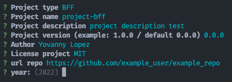

# nestjs-bootstrap

> Template for projects with Nest.js framework

This project is a generator that contains templates to create projects with the nest.js framework.

---

## Pre-reqs ⚙️

<p align="center">
  = 16.16.0&labelColor=339933&color=757575&logoColor=FFFFFF&logo=node.js" alt="Node.js website"/>
  = 8.11.0&labelColor=CB3837&logoColor=FFFFFF&color=757575&logo=npm" alt="Npm website"/>
</p>

---

## Contents 📦

- [Installation](#installation-⚙️)
- [Running the app](#running-the-app-🚀)
- [Test your app](#test-your-app-🧪)
- [Conventions](#conventions-🚩)
- [Contributors](#contributors-👷)

---

## Installation ⚙️

### 1. Clone repo

### 2. Entry

```shell
$ cd nestjs-bootstrap
```

### 3. Install dependencies

```shell
$ npm install
```

---

⏪️ - [Back](#contents-📦)

---

## Running the generator 🚀

```bash
$ npm run generate
```

Answer the generator questions. Example:



At the end you will find the generated project in the '/app' folder.

---

⏪️ - [Back](#contents-📦)

---

### Test your app 🧪

1. Run command `cd app`
2. Run command `npm install`
3. Run command `npm run dev`

---

⏪️ - [Back](#contents-📦)

---

## Conventions 🚩

View info:

- [Semantic versioning](https://semver.org/)
- [Conventional commits](https://www.conventionalcommits.org/en/v1.0.0-beta.4/)

---

⏪️ - [Back](#contents-📦)

---

## Contributors 👷

- Yovanny López (Backend Developer)
- Javer Benavidez (Backend Developer)
- Rene Nicolás Palenque (Backend Developer)
- Maximiliano Espindola (Backend Developer)

---

⏪️ - [Back](#contents-📦)

---

## License

**nestjs-bootstrap** is available under the MIT [license](LICENSE.md).

    Copyright (c) 2022 Wolox part of Accenture

    Permission is hereby granted, free of charge, to any person obtaining a copy
    of this software and associated documentation files (the "Software"), to deal
    in the Software without restriction, including without limitation the rights
    to use, copy, modify, merge, publish, distribute, sublicense, and/or sell
    copies of the Software, and to permit persons to whom the Software is
    furnished to do so, subject to the following conditions:

    The above copyright notice and this permission notice shall be included in
    all copies or substantial portions of the Software.

    THE SOFTWARE IS PROVIDED "AS IS", WITHOUT WARRANTY OF ANY KIND, EXPRESS OR
    IMPLIED, INCLUDING BUT NOT LIMITED TO THE WARRANTIES OF MERCHANTABILITY,
    FITNESS FOR A PARTICULAR PURPOSE AND NONINFRINGEMENT. IN NO EVENT SHALL THE
    AUTHORS OR COPYRIGHT HOLDERS BE LIABLE FOR ANY CLAIM, DAMAGES OR OTHER
    LIABILITY, WHETHER IN AN ACTION OF CONTRACT, TORT OR OTHERWISE, ARISING FROM,
    OUT OF OR IN CONNECTION WITH THE SOFTWARE OR THE USE OR OTHER DEALINGS IN
    THE SOFTWARE.
